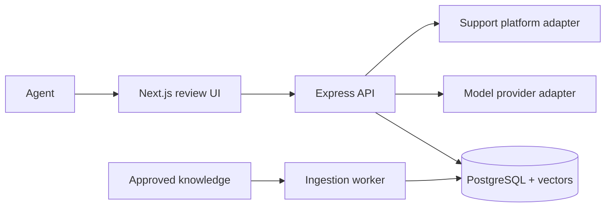

# Architecture: Support Copilot

> Status: Accepted for pilot
> Owner: AI platform lead
> Product source: [`product.md`](product.md)

**Playbook lesson:** the model call is one boundary in a larger system. The
architecture earns trust through source ownership, runtime validation,
evaluation, auditability, privacy, and a safe manual fallback.

## Summary

Support Copilot is a Next.js review interface and an Express API backed by PostgreSQL with `pgvector`. A background worker ingests approved knowledge. The API retrieves passages, sends minimized context through a provider adapter, validates structured output, verifies citations, and returns either an evidence-linked draft or an explicit insufficient-evidence result.



## Modules

```text
apps/web/                    # Ticket context and evidence-review UI
apps/api/src/modules/
├── suggestions/             # Orchestrates retrieval, generation, validation
├── knowledge/               # Sources, chunks, versions, approval state
├── evaluations/             # Datasets, runs, rubric results
├── feedback/                # Agent disposition and quality signals
└── support-platform/        # Ticket adapter; no model logic
packages/
├── contracts/               # Runtime schemas and generated client types
├── prompts/                 # Versioned prompt files and changelog
├── models/                  # OpenAI/OpenRouter adapter and routing policy
└── database/                # Prisma schema, migrations, repositories
```

The suggestions module depends on retrieval and model interfaces. Provider SDKs stay in `packages/models`. Prompts are versioned artifacts and each evaluation run records prompt, model, retrieval configuration, and dataset versions.

## Data and retrieval

- `KnowledgeSource`: URL, title, approval state, owner, content hash, effective dates.
- `KnowledgeChunk`: source version, text, embedding, heading path, token count.
- `Suggestion`: ticket reference, prompt/model/retrieval versions, status, latency, cost, encrypted draft, expiry.
- `Citation`: suggestion, chunk, cited claim, character span.
- `Feedback`: disposition, reason, edit-distance summary, evaluator outcome.
- `EvaluationRun`: immutable configuration and aggregate/per-case results.

PostgreSQL row policies and application checks restrict a tenant to its sources and suggestions. Raw ticket content and drafts expire after 30 days in the pilot; evaluation examples are separately reviewed and de-identified.

Retrieval filters to approved, effective, tenant-owned sources before vector and keyword hybrid ranking. The top passages are reranked within a token budget. The system records chunk IDs, not only rendered text, for auditability.

## Draft contract

`POST /v1/tickets/:ticketId/suggestions`

- Auth: support agent session; ticket access checked through the platform adapter.
- Input: optional agent instruction from a constrained schema and idempotency key.
- Success: `201` with `status: "draft"`, structured sections, citations, limitations, and telemetry-safe IDs.
- Insufficient evidence: `200` with `status: "insufficient_evidence"` and no invented response.
- Errors: `ticket_unavailable`, `knowledge_unavailable`, `generation_timeout`, and stable request ID.

The model output schema includes draft text and claim-to-chunk citations. The server rejects unknown chunk IDs, citations whose passage does not support the cited span according to a verification step, invalid output, and disallowed content. One bounded retry may correct schema failure; other failures degrade to no suggestion.

## Models, prompts, and routing

OpenAI is the pilot default for generation and embeddings. A provider-neutral interface supports OpenRouter when multi-provider routing is enabled in production. The routing policy selects a cheaper evaluated model for query classification and a higher-quality model for final drafting. Model identifiers are pinned.

Prompts define role, allowed sources, refusal behavior, output schema, examples, and prompt-injection handling. Retrieved text is untrusted data, delimited from instructions, and cannot grant tools or change system policy. This workflow uses no write-capable MCP tools; any future tool must be allowlisted with per-call authorization and human confirmation for external effects.

## Evaluation gate

The initial dataset contains 100 representative questions with expected source passages, answer requirements, and risk labels. Release requires:

- retrieval recall@5 of at least 90% on answerable cases;
- claim support precision of at least 95%;
- zero critical policy failures;
- refusal on at least 95% of deliberately unanswerable cases;
- p95 under 8 seconds and average cost within budget.

Prompt, model, source-processing, or retrieval changes run the fixed regression set plus sampled human review. Production feedback does not automatically train or alter prompts.

## Security, operation, and failure

The API minimizes ticket fields before model calls, redacts known secrets, uses provider data controls, and never logs prompt bodies. It encrypts short-lived drafts and audits source approval, suggestion access, and feedback. All model and support-platform calls have timeouts and bounded retries.

Vercel hosts the frontend; Render hosts the API and ingestion worker; managed PostgreSQL stores data. Queued ingestion is idempotent by source content hash. If models, retrieval, or support APIs fail, the UI preserves the existing manual workflow and shows no partial draft.

Scaling starts with query and vector indexes, batching ingestion, and worker concurrency. A separate vector store is considered only when measured PostgreSQL latency or corpus scale exceeds the documented budget.
