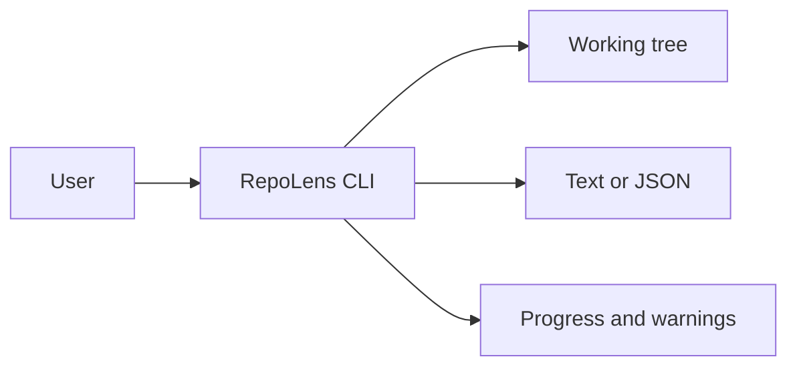

# Architecture: RepoLens

> Status: Accepted for private preview
> Owner: Developer tools engineer
> Product source: [`product.md`](product.md)

**Playbook lesson:** the architecture is a local pipeline with a frozen
command contract. Scanners may change; stdout, JSON schema, and the rule that
defaults never write may not change casually.

## Summary

RepoLens is a single local Node.js TypeScript CLI. There is no server, daemon, or hosted component. A modular monolith inside one process owns detection, mapping, and rendering. Package managers, git, and test runners are not invoked unless a later documented command exists; v1 only reads files.



## Structure and dependencies

```text
src/
├── cli/                 # Argv parsing, help, exit codes
├── modules/
│   ├── detect/          # Manifest and layout detectors
│   ├── map/             # Module graph from observed facts
│   └── render/          # Text and JSON writers
├── contracts/           # Runtime schemas for argv and output
└── fs/                  # Bounded, follow-link-safe reader
test/fixtures/           # Golden JSON and fake repositories
```

The CLI layer maps argv to one command, validates flags, and chooses an exit code. `detect` returns observed facts with file citations. `map` may add inferred nodes, always labeled. `render` is the only writer, and it writes only to stdout/stderr. No module imports a package-manager or test-runner SDK in v1.

## Data and state

RepoLens is stateless across runs. It does not write cache files by default. In-memory records:

- `Fact`: path, kind (`package_manifest`, `ci_workflow`, `entry_point`, `test_script`), citation, observed.
- `ModuleRecord`: name, root path, entry points, test commands, `evidence: observed | inferred`.
- `MapDocument`: `schemaVersion`, repository root, modules, warnings, generated-at.

Ignore rules skip `node_modules`, `.git`, build output, and an optional `.repolensignore`. Traversal has a file-count and depth cap; exceeding it is a warning plus partial map, not a hang.

Secrets: files that look like `.env` or key material are not opened for mapping. Their paths may appear as skipped.

## Command contract

| Command | Default behavior | Output |
| --- | --- | --- |
| `repolens map` | Read-only map | Text on stdout |
| `repolens map --json` | Same scan | `MapDocument` JSON on stdout |
| `repolens map --help` | No scan | Help text |

Flags: `--root` (default cwd), `--json`, `--quiet` (no stderr progress). There is no `--write`, `--fix`, or `--run-tests` in v1.

Exit codes: `0` map produced, `2` invalid argv, `3` root is not a recognized repository, `1` unexpected error. JSON mode still uses these codes; errors that prevent a document go to stderr as text, not a second JSON schema, unless `--json` can emit a versioned `error` document without breaking success parsers—preview uses stderr errors plus non-zero exit.

`--json` compatibility: `schemaVersion` is an integer. Additive fields are allowed. Renames and type changes require a version bump and a changelog entry. Golden fixtures in CI fail on accidental churn.

Human text may change more freely; scripts must use `--json`.

## Safety and trust boundaries

The filesystem is untrusted. The reader does not follow symlinks outside `--root`, does not execute files, and does not interpolate file contents into a shell. Default commands make no network requests.

Stdout is data. Progress, warnings, and deprecation notes go to stderr so pipes stay clean. Unicode and large paths are escaped in JSON.

If detection is uncertain, the map emits a warning and labels inference. It does not invent a test command from folklore (`npm test` is included only when a manifest or CI file contains it).

## Deployment, testing, and operation

The artifact is an npm CLI package run with `npx` or a local binary. There is no Render or Vercel topology. Releases are versioned with the JSON schema.

CI runs unit tests for detectors, contract tests against golden JSON, and integration tests on fixture repositories including a repo with a stale README and a correct CI test command. A write-guard test fails if default `map` creates or modifies files.

Operation is local: if a scan hits the file cap, the user sees a stderr warning and a partial map. There are no crash-reporting hooks in preview.

## Evolution triggers

Add language-specific detectors when fixture recall for test commands falls below the 90% target. Add an explicit `repolens test --dry-run` only after the map contract is stable; execution remains opt-in. Add a cache directory only behind a flag when measured scan time exceeds five seconds on the published fixture. Do not add a daemon, cloud account, or auto-update that mutates the tree. Extract packages internally if detector ownership splits; do not split into services.
