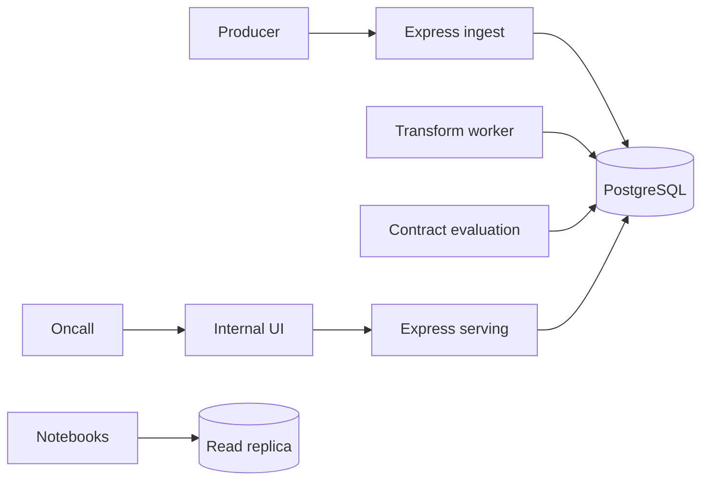

# Architecture: SignalWell

> Status: Accepted for internal pilot
> Owner: Data platform lead
> Product source: [`product.md`](product.md)

**Playbook lesson:** contracts, watermarks, restatement, and evaluation are
modules with owners. A notebook is an untrusted client of those modules, not
the system of record.

## Summary

SignalWell is a modular monolith: an Express TypeScript ingest and serving API, a transform worker, PostgreSQL through Prisma, and a small Next.js internal UI. Five official metrics share one database. Event schemas, late-arrival rules, and evaluation fixtures live in versioned repository artifacts. No separate streaming cluster, lake, or microservice is introduced for a 40-person ops audience.



## Structure and dependencies

```text
apps/api/src/modules/
├── contracts/          # Schema registry, owners, compatibility
├── ingest/             # Validation, idempotent append
├── warehouse/          # Durable events and watermarks
├── metrics/            # Official definitions and serving
└── evaluation/         # Fixtures, freshness, completeness
apps/worker/            # Restatement and check entry points
apps/web/               # Metric pages and contract status
packages/contracts/     # Runtime event and metric schemas
packages/database/      # Prisma and repositories
```

HTTP handlers validate and call module services. Only `ingest` writes raw events. Only `metrics` publishes official values. `evaluation` may read warehouse tables and write check results; it cannot change metric formulas. Notebooks have replica credentials and no serving-table grants. Repositories are the only layer that import Prisma.

## Data and state

- `EventContract`: name, version, owner, schema hash, compatibility mode, status.
- `EventRecord`: contract version, producer, occurred-at, received-at, payload, idempotency key.
- `Watermark`: metric, window, open/closed, late-event count.
- `MetricDefinition`: formula, grain, owner, unit, restatement policy, source contracts.
- `MetricValue`: definition version, window, value, completeness, restated-at.
- `EvaluationRun`: fixture set version, pass/fail, failing contract or check.

Events are append-only. Idempotency is `(producer, idempotency key)` unique. `occurred_at` is the fact time; `received_at` is ingest time. Late means `received_at` after the window end and still inside the metric's declared watermark. After the watermark closes, later events are stored but do not change that window; they increment an excluded-late counter for operators.

## API and protocol contract

`POST /v1/events` accepts a contract name, version, idempotency key, occurred-at, and payload. Unknown contracts, schema failures, and incompatible versions return `422 contract_rejected` with a stable code. Successful ingest returns `202` and the assigned event id.

`GET /v1/metrics/:id` returns the official value, definition version, watermark state, completeness, and last restatement. It never returns a notebook SQL string as the definition.

`POST /v1/evaluation/runs` is operator-triggered or scheduled. Breaking contract changes fail CI when fixtures are updated without a version bump.

Mutations that ingest events or close watermarks require idempotency keys. Serving schemas are independent of Prisma models and of producer SDK types.

## Auth, safety, and untrusted inputs

Internal SSO identifies users. Producers authenticate with scoped ingest tokens bound to allowed contract names. On-call can read metrics; only metric owners can change definitions, through reviewable repository changes rather than a live SQL editor.

Payloads are untrusted. Ingest enforces size limits, required fields, and a denylist for secret-like keys. Logs store contract, ids, and outcome codes, not raw payloads. PII does not belong in official events; rejected payloads that look like personal data increment a redaction metric.

## Deployment, testing, and operation

One API service, one worker, and managed PostgreSQL deploy together. A read replica, if enabled, is for exploration only. CI runs contract compatibility tests, restatement unit tests, warehouse integration tests, and the evaluation fixtures for the five metrics.

Alerts: ingest rejection spikes, watermark stuck open, completeness below the metric's threshold, restatement lag, evaluation failures, and database saturation. If the worker is down, serving continues to show last values with an explicit stale watermark rather than a blank or a guessed number.

## Evolution triggers

Add partitioning or a dedicated event store when measured ingest volume or retention cost exceeds the documented PostgreSQL budget. Add a queue in front of ingest only if producer timeouts become a measured incident. Extract a metric-serving replica when on-call read latency exceeds the SLO while ingest load is the cause. Do not introduce a lakehouse or stream processor to make the architecture look like a data platform. Notebooks never become an official publish path.
