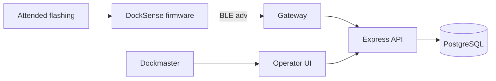

# Architecture: DockSense

> Status: Accepted for hardware pilot
> Owner: Embedded systems lead
> Product source: [`product.md`](product.md)

**Playbook lesson:** the firmware image is a bounded, fail-safe program. The
cloud side stays a modular monolith. Range, battery, and detection accuracy
are measurement gates, not architecture decorations.

## Summary

DockSense has three pieces in one product boundary: a small BLE firmware image on a battery-powered SoC, a pier or office gateway that observes advertisements, and an Express TypeScript API plus operator UI with PostgreSQL. The backend does not infer vacant from missing packets. Hardware-in-the-loop tests are required before any physical claim.



## Structure and dependencies

```text
firmware/
├── sense/               # Occupancy sampling and debounce
├── radio/               # BLE advertisement builder
├── power/               # Sleep and brownout handling
└── failsafe/            # Unknown-on-fault defaults
apps/gateway/            # BLE observer and forwarder
apps/api/src/modules/
├── devices/             # Identity, slip mapping, last-seen
├── occupancy/           # Server-side state and timeouts
└── ingest/              # Authenticated gateway reports
apps/web/                # Operator board
packages/contracts/      # BLE payload and HTTP schemas
```

Firmware modules do not include a network stack beyond BLE advertisements. The gateway is a translator: it does not decide occupancy. `occupancy` on the server applies the stale timeout. Repositories are the only API layer that import Prisma. The SoC SDK stays behind `firmware/radio` and `firmware/power`.

## Data and state

Firmware keeps no durable occupancy history. It samples, debounces, and advertises `occupied`, `vacant`, or `fault`. Brownout, sensor fault, and failed self-check advertise `fault`.

Server entities: `Device`, `SlipMapping`, `OccupancyReport`, `OccupancyState` (`occupied`, `vacant`, `unknown`), `LastSeen`. Reports are append-only. The served state is `unknown` when `now - last authentic report` exceeds the configured timeout, regardless of the last occupied/vacant value. A `fault` advertisement also yields `unknown` for operators.

Slip mapping is a backend record so a replaced puck does not keep a burned-in slip name as the only identity. Utilization metrics must not count `unknown` as `vacant`.

## Protocol contract

BLE advertisement (v1): device id, occupancy enum, firmware version, battery-voltage band (coarse, not a life claim), sequence number. Payload size fits a legacy advertisement. Unauthenticated observers may see occupancy; that is accepted for the pilot because slips are visible from the dock. The gateway authenticates to the API.

`POST /v1/gateways/reports` — gateway identity, device id, observed payload, radio RSSI, received-at. Idempotent on `(gateway, device, sequence)`. Invalid payloads return `422`.

`GET /v1/slips` — slip, served occupancy, last-seen, source (`report` or `timeout`). Never returns raw SoC vendor types.

The firmware image budget and bootloader presence are recorded as constraints. Pilot flashing is attended and local; there is no unattended OTA in this architecture.

## Safety and fail-safe defaults

Power-on default before the first valid sample is `fault` (served as unknown), not `vacant`. Watchdog reset returns to the same default. Debounce lives in firmware so a person walking the finger pier does not toggle vacant; the debounce window is a named constant and a test, not a tuned-in-the-field secret.

The API trusts gateway credentials, not BLE observers on the public pier. Device ids are not customer identifiers. Logs store device ids, slip ids, and enums, not RSSI traces by default.

What this design does not claim: battery months, meters of range, IP rating, or detection precision. Those require named bench and dock trials. Architecture tests assert fail-safe state machines and protocol parsing, which is not a substitute for hardware evidence.

## Deployment, testing, and operation

Firmware builds in CI as a size-checked image and unit-tests sense/fail-safe on host. Hardware-in-the-loop runs on a bench jig before dock install: power loss, sensor cover, gateway down, duplicate sequence. The API and UI deploy as one backend with managed PostgreSQL. Gateways are provisioned devices, not cloud microservices.

Alerts: slip unknown beyond expected, gateway silence, ingest authentication failures, and image-size regressions. If the API is down, firmware still advertises; the operator is told the board is stale, not that slips are vacant.

## Evolution triggers

Add OTA only with an A/B image and a recover-in-place procedure after a failed dock trial of attended updates. Add a second radio only if measured BLE coverage on the pier fails. Split gateway software only if fleet size or isolation requires it. Do not add cameras or identity to improve occupancy accuracy. Revisit debounce and timeout from dock evidence, not from dashboard aesthetics.
