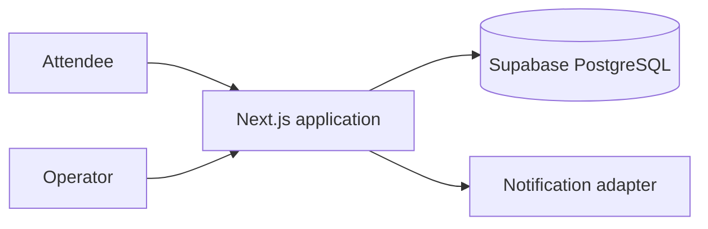

# Architecture: QueueLess

> Status: Accepted for prototype
> Owner: Hackathon technical lead
> Product source: [`product.md`](product.md)

**Playbook lesson:** the simplest architecture wins here. A separate backend,
queue service, or real-time system would create more demo risk than product
value. The module boundaries remain because code can be simple without being
tangled.

## Summary

QueueLess is one Next.js application deployed to Vercel, with server-side operations and PostgreSQL through Supabase. This is intentionally smaller than the preferred split Next.js/Express topology: a separate API would consume the short schedule without satisfying an independent-client or scaling need. Boundaries remain explicit so an API can be extracted later.



## Modules and structure

```text
src/
├── app/                    # Attendee and operator routes
├── modules/
│   ├── queues/             # Join, leave, advance, position rules
│   └── notifications/      # Provider-neutral notification interface
├── db/                     # Prisma client and repositories
├── contracts/              # Runtime input and response schemas
└── auth/                   # Operator session check
prisma/
└── schema.prisma
docs/
├── product.md
└── architecture.md
```

Route handlers validate HTTP input and call queue services. Queue services own transaction rules. Repositories are the only modules that import Prisma. Notification delivery occurs after a durable queue transition and cannot reverse it.

## Data

- `Booth(id, name, operatorSecretHash, averageServiceSeconds)`
- `QueueEntry(id, boothId, displayName, encryptedPhone, statusTokenHash, positionSequence, status, joinedAt, calledAt, completedAt)`
- `NotificationAttempt(id, entryId, kind, status, providerMessageId, attemptedAt)`

One partial unique constraint permits only one active entry for the normalized phone hash and booth. Advancing runs in a database transaction, locks active entries for the booth, completes the current entry, and calls the next. Sequence numbers never change; position is the count of earlier active entries.

## Contracts

| Operation | Auth | Result and important errors |
| --- | --- | --- |
| `POST /api/booths/:id/entries` | Public + rate limit | `201` opaque status token; `409 already_joined` |
| `GET /api/entries/:token` | Opaque token | Status, people ahead, estimate; `404` |
| `DELETE /api/entries/:token` | Opaque token | `204`; idempotent |
| `POST /api/operator/booths/:id/advance` | Secure operator cookie | Called entry; `409 queue_empty` |

All inputs use runtime schemas. Responses never contain a phone number. Advance accepts an idempotency key to prevent a double tap from skipping an attendee.

## Authentication and privacy

Attendees use 128-bit random opaque links stored as hashes. The operator uses a single booth secret exchanged for a secure, HTTP-only, same-site cookie. Join and status endpoints are rate-limited. Logs contain entry IDs but no names, tokens, or phone numbers. A scheduled cleanup deletes phone data after 24 hours.

## Deployment and operation

- Vercel hosts application and preview deployments.
- Supabase hosts PostgreSQL; secrets are environment variables.
- A seeded demo booth and scripted 20-person simulation verify the flow.
- Structured logs cover join, advance, and notification result with request IDs.
- If notifications fail, the attendee status page remains authoritative.
- Before the live demo, export no personal data; reset the queue from a protected operator action.

## Scaling and deliberate shortcuts

The initial load fits one database and serverless application. Add an asynchronous notification queue only if request latency or delivery retry becomes a measured problem. Extract an Express API when there is a second client or independent worker deployment.

Accepted prototype shortcuts: one operator role, approximate wait based on a fixed average, and no offline mode. These are product constraints, not hidden technical debt.
