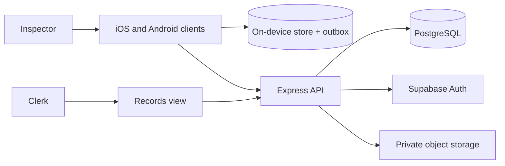

# Architecture: FieldNote

> Status: Accepted for field pilot
> Owner: Mobile application lead
> Product source: [`product.md`](product.md)

**Playbook lesson:** the mobile clients are not a second product. Shared
inspection and sync rules live behind one API; platform adapters own
permissions, camera, and durable local storage. Store constraints are
architecture because they forbid whole classes of design.

## Summary

FieldNote is a modular monolith: React Native clients on iOS and Android, an Express TypeScript API, PostgreSQL through Prisma, and private object storage for evidence photos. Each device keeps an encrypted local store and an inspection outbox. One backend serves the pilot; there is no separate "mobile BFF" until a measured client-specific contract appears.



## Structure and dependencies

```text
apps/mobile/src/
├── features/inspections/    # Draft UI and local complete
├── features/sync/           # Outbox drain, conflict display
└── platform/                # Permission, camera, filesystem adapters
apps/api/src/modules/
├── assignments/             # Supervisor site lists
├── inspections/             # Server state and submit rules
├── media/                   # Photo upload policy
└── identity/                # Inspector membership
packages/contracts/          # Runtime schemas shared by clients
packages/domain/             # Inspection and sync state transitions
```

Clients call module APIs after schema validation. Domain rules for complete, retry, and conflict live in `packages/domain`, not in screen components. Repositories are the only API layer that import Prisma. Platform permission APIs stay behind adapters so iOS and Android differences do not leak into inspection state.

## Data and state

On device: `AssignmentCache`, `InspectionDraft`, `PhotoBlob` (local file reference), `OutboxItem`, `SyncReceipt`. Drafts are unique per inspector and assignment. Complete is a local state; it does not require an HTTP round trip.

On the server: `Inspector`, `Assignment`, `Inspection` (submitted snapshot), `Photo` (object key, scan state, stripped metadata), `SubmitIdempotency`. Inspection states are `accepted`, `rejected_conflict`, and `replaced_only_by_owner_before_lock`. The pilot locks a record after first successful submit.

Photo EXIF is stripped on device when possible and again on upload completion. The product stores the assigned site identifier, not a location trail. An optional one-shot location sample may be attached as corroboration and is omitted when permission is denied.

## API and sync contract

The `/v1` API includes assignment download, idempotent inspection submit, signed photo upload start/complete, and sync acknowledgement. Submit uses an idempotency key created on the device at local complete. Conflicts return `409 inspection_locked` or `409 assignment_not_owned`; the client surfaces needs-attention rather than retrying forever.

Responses never include another inspector's drafts or precise coordinates. Prisma models are not exposed. Photo bytes do not travel in the JSON body.

The outbox drains in order per inspection, with bounded retries for transient network errors and a stop-and-alert path for validation or permission-to-upload failures. A crash mid-drain must leave the item retryable without duplicate photos.

## Authentication, permissions, and privacy

Supabase Auth identifies the inspector; the API loads current municipal membership on every mutation. Assignment download is scoped to that inspector. The records clerk role can read submitted inspections, not in-progress device drafts.

Permission policy is product state: camera denied blocks only photo-required items; location denied is a no-op on site identity; notification denied still syncs in the foreground. The clients do not request background location or full photo-library access.

Logs omit photo bytes, tokens, exact coordinates, and note bodies. Store privacy labels and Android data-safety disclosures must list camera, optional approximate location, and photos actually collected.

## Deployment, testing, and operation

The API and a small records UI deploy as one backend service with managed PostgreSQL and private object storage. Clients ship through TestFlight and an internal Play track before public store review. CI runs domain tests for sync and conflict, API contract tests, and device tests for process death, airplane mode, and permission denial.

Operational signals: outbox age, submit error codes, photo processing failures, auth failures, and crash-free sessions. If the API is down, local complete remains available; the inspector sees pending sync.

## Evolution triggers

Add a native module only when a measured platform API cannot be expressed through the current adapter. Add background upload only if foreground drain misses the 24-hour sync target and store review still allows the narrower mode. Split a mobile-specific gateway only when payload or auth requirements diverge enough to justify a second contract. Do not claim battery, crash, or offline durability targets beyond what the instrumented pilot measured.
