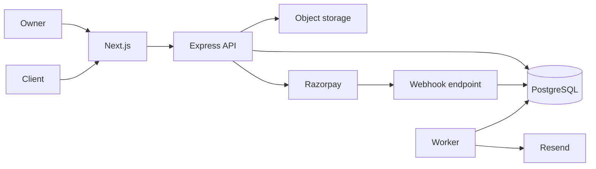

# Architecture: InvoiceFlow

> Status: Accepted for private beta
> Owner: Technical founder
> Product source: [`product.md`](product.md)

**Playbook lesson:** financial workflows make failure and recovery product
concerns. Tenant scoping, immutable invoice snapshots, verified webhooks,
reconciliation, and audit events are designed before the dashboard.

## Summary

InvoiceFlow uses a Next.js frontend on Vercel and a modular Express API plus worker on Render. PostgreSQL is the system of record through Prisma. Razorpay handles payments, Resend sends transactional email, and S3-compatible storage holds immutable invoice PDFs. Modules share one deployment and database but own their tables and expose service interfaces.

## Modules and boundaries

- **identity:** accounts, Supabase Auth identity mapping, sessions, organization membership.
- **organizations:** tenant settings, roles, invitations, and ownership transfer.
- **customers:** organization-owned billing contacts.
- **invoices:** profiles, immutable issued snapshots, state transitions, PDFs, signed public views.
- **payments:** Razorpay orders, verified events, allocations, reconciliation; the only module importing the Razorpay SDK.
- **reminders:** schedules, due work, delivery attempts, and stop conditions.
- **subscriptions:** InvoiceFlow's own plan and entitlements, isolated from client invoice payments.
- **audit:** append-only records for sensitive state changes.

HTTP routes call module services after schema validation. Services enforce membership, ownership, and state rules. Repositories own Prisma access. Cross-module changes call public service interfaces or write transactional outbox events; they do not mutate another module's tables directly.

## Tenant and authorization model

Every tenant-owned record includes `organizationId`. Repository methods require an organization scope and composite indexes begin with it. Membership roles are `owner`, `admin`, and `staff`; permissions are operation-specific. Public invoice access uses a high-entropy token stored as a hash and reveals one issued invoice only.

Supabase Auth establishes identity. The API verifies its signed token and loads current membership; identity claims alone do not confer organization access. Automated tests attempt cross-tenant reads and writes for every tenant-owned route. Production database roles prevent the web client from direct table access.

## Invoice and payment data

An issued invoice is an immutable snapshot of customer name, address, tax details, line items, totals, currency, due date, terms, and document number. Editing a customer never rewrites history. Corrections void and replace an invoice.

Important entities include `Organization`, `Membership`, `Customer`, `InvoiceProfile`, `Invoice`, `InvoiceLine`, `PaymentOrder`, `Payment`, `PaymentAllocation`, `ReminderSchedule`, `EmailDelivery`, `OutboxEvent`, and `AuditEvent`.

Invoice totals are calculated server-side using integer minor currency units and database constraints. Invoice numbers are unique per organization and allocated transactionally. The sum of payment allocations determines `partially_paid` or `paid` state.

## API and compatibility

The `/v1` JSON API publishes an OpenAPI contract. Important operations include creating invoice profiles, issuing and sending invoices, creating a Razorpay order for a public invoice, recording an offline payment, and listing an organization's invoices with cursor pagination.

Mutations that create invoices, orders, or offline payments require idempotency keys scoped to organization and operation. Errors use stable codes such as `invoice_state_conflict` and `organization_access_denied`. API schemas are independent of Prisma models.

## Payment and email reliability

The Razorpay webhook handler reads the raw body, verifies the signature, stores each provider event under a unique event ID, and acknowledges quickly. Processing is idempotent and asynchronous. Client redirects never mark an invoice paid. A scheduled reconciliation job checks outstanding orders against the provider.

State transitions write outbox events in the same transaction. The worker claims events with a lease, applies bounded retry with backoff, and dead-letters repeated failures. Before sending a reminder it rechecks invoice balance and status, preventing stale queued work from emailing a paid client. Resend delivery IDs and webhook results update delivery state.

## Storage and privacy

Generated PDFs go to a private S3-compatible bucket under organization-scoped keys. The API returns short-lived signed URLs after authorization. Upload types and sizes are validated. Financial records follow a documented retention policy; account deletion begins an export-and-review workflow rather than immediately destroying legally required records.

Secrets and personal data are excluded from logs. Audit events record actor, organization, action, entity, timestamp, request ID, and safe change metadata.

## Deployment and operation

Vercel deploys preview and production frontends. Render deploys separate API and worker processes from one image with health checks and graceful shutdown. Managed PostgreSQL uses connection pooling, daily backups, point-in-time recovery where available, and quarterly restore tests. Prisma migrations follow expand-and-contract delivery.

Key alerts cover API error/latency, webhook verification failures, old unprocessed outbox events, reminder dead letters, reconciliation mismatches, and database saturation. Runbooks name manual retry and reconciliation procedures.

## Scaling triggers

Start with one regional API, worker, and PostgreSQL instance. Add worker concurrency when oldest queued event exceeds two minutes. Add read optimization and indexes when invoice-list p95 exceeds 300 ms. Extract payments or reminders only if independent reliability, ownership, or scaling becomes necessary; transaction and outbox boundaries make that evolution possible.
