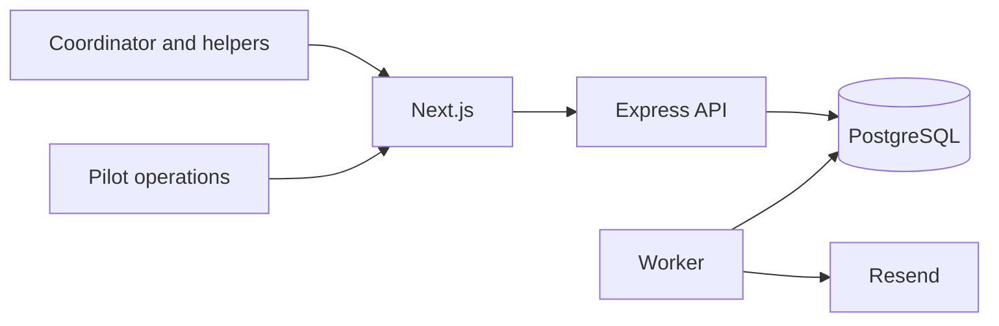

# Architecture: CareCircle

> Status: Accepted for concierge pilot
> Owner: Founding engineer
> Product source: [`product.md`](product.md)

**Playbook lesson:** the system protects consent and access from the first
pilot but delays clinical integrations, orchestration systems, and service
extraction until a validated product need can pay for them.

## Summary

CareCircle uses a Next.js frontend, an Express TypeScript API, a worker, and PostgreSQL through Prisma. Supabase Auth provides identity, Resend delivers email, and all components begin in one region. A modular monolith keeps operating cost low while isolating identity, circles, tasks, consent, notifications, and audited operations.

The architecture deliberately does not include medical integrations, event streaming, microservices, a mobile application, or a generic workflow engine. Those choices would increase cost before the product assumptions are validated.

## Module boundaries

- **identity:** Supabase identity mapping and session verification.
- **circles:** care-circle lifecycle, membership, roles, invitations, and removal.
- **consent:** participant consent record, policy version, revocation, and visibility constraints.
- **tasks:** task creation, claim, assignment, completion, reopening, and overdue state.
- **notifications:** preferences, digest scheduling, delivery attempts, and provider adapter.
- **operations:** narrow audited support actions used during the concierge pilot.
- **audit:** append-only record of membership, consent, task, and support changes.

Routes validate input and call module services. Each service performs authorization using current membership and consent state. Repositories require a circle scope and are the only modules that use Prisma. Operations cannot bypass domain rules; it calls the same services with an audited operator identity.

## Data and authorization

Core entities are `User`, `CareCircle`, `Membership`, `Invitation`, `ConsentRecord`, `Task`, `TaskEvent`, `NotificationPreference`, `NotificationDelivery`, and `AuditEvent`.

Every circle-owned row includes `circleId`. A coordinator can manage membership and tasks but cannot erase consent history. Helpers can read active members and tasks and update only tasks they may claim or own. The participant or an authorized coordinator can revoke a membership; revocation invalidates authorization on the next request and queued notifications recheck membership before sending.

Free-text fields have short limits and warnings against entering medical details. There is no field for diagnosis, medication, or clinical identifier. Database and application constraints enforce one active membership per user and circle, one active invitation per email and circle, and valid task-state transitions.

## Contracts

The `/v1` API publishes runtime schemas and generated client types for circle creation, invitation acceptance, member listing/removal, consent recording, task list/create/claim/complete/reopen, preferences, and coordinator digest.

Errors distinguish invalid or expired invitation, missing consent, membership revoked, task conflict, and rate limit. Invitations use one-time opaque tokens stored as hashes. Claim and complete operations accept idempotency keys and use optimistic concurrency so two helpers cannot silently own the same task.

Backend contracts are implemented and integration-tested before the corresponding frontend journey. API responses never contain email addresses for members who have chosen a display name, internal audit metadata, or provider identifiers.

## Notifications and manual operations

Task changes write an outbox event in the same database transaction. The worker creates user-specific notifications only after checking current membership, task ownership, and preferences. Email delivery uses bounded retries; failures appear in an operations queue and never change task completion.

The pilot admin interface supports resend invitation, remove access, correct a task after confirmation, export a circle, and begin deletion. Every action requires a reason and creates an audit event. There is no arbitrary database editor in the interface.

## Security and privacy

The API verifies Supabase tokens and performs object-level authorization on every operation. Secure configuration, least-privilege database roles, rate limits, encrypted transport, short invitation expiry, session revocation, and structured audit logs are required for the pilot. Logs contain IDs and outcome codes, not task notes, emails, tokens, or message bodies.

Circle data is not used for model training or advertising. Export and deletion are implemented before self-service launch. Backups are encrypted and their retention matches the published policy. The threat model specifically covers guessed invitations, stale membership, abusive family members, support-agent misuse, and sensitive content in free text.

## Deployment and verification

Vercel hosts the frontend; Render hosts API and worker processes; managed PostgreSQL provides daily backups. Preview environments use synthetic data. CI runs domain tests for permissions and task transitions, PostgreSQL integration tests, contract tests, and end-to-end invitation and task journeys.

Alerts cover authorization anomalies, invitation abuse, old outbox events, delivery failures, API error rate, and database saturation. During the ten-family pilot, a named founder owns incidents and can pause invitations and notification delivery independently.

## Reversible evolution

Provider-specific email and identity code is behind adapters. The outbox allows a queue to be introduced if notification volume requires it. A native client can reuse the versioned API. Service extraction is considered only after team ownership or independent reliability warrants it.

The first scaling decision is product scale: if evidence thresholds fail, archive or reshape the workflow instead of optimizing infrastructure. If they pass, add self-service onboarding and billing as new documented modules rather than generalizing the pilot operations interface.
