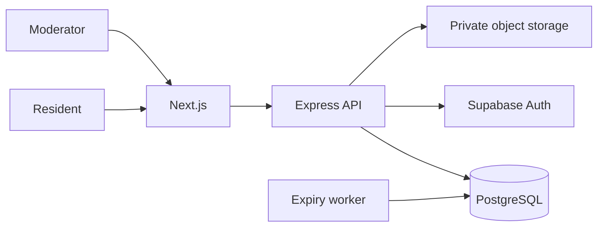

# Architecture: LocalBoard

> Status: Accepted for pilot
> Owner: Application lead
> Product source: [`product.md`](product.md)

**Playbook lesson:** this is intentionally ordinary architecture. Strong
authorization, content state, private media, and operational signals matter;
fashionable infrastructure does not.

## Summary

LocalBoard is a modular monolith: Next.js on Vercel, an Express TypeScript API on Render, PostgreSQL through Prisma, Supabase Auth, and private S3-compatible image storage. One application and database are simpler to deploy and operate for a single-neighborhood pilot; modules enforce boundaries for later change.



## Structure and dependencies

```text
apps/api/src/
├── modules/
│   ├── neighborhoods/       # Membership and invitation policy
│   ├── posts/               # Post state, feed query, expiry
│   ├── moderation/          # Reports and moderator decisions
│   ├── media/               # Upload policy and storage adapter
│   └── saved-posts/         # Private resident bookmarks
├── middleware/              # Auth, request IDs, rate limits, errors
└── jobs/                    # Expiry and cleanup entry points
apps/web/src/features/       # Matching user-facing capabilities
packages/contracts/          # Runtime API schemas and generated types
packages/database/           # Prisma and repositories
docs/                        # Product, architecture, decisions
```

Routes validate and translate HTTP. Services own state transitions and authorization policy. Repositories are organization/neighborhood scoped and are the only application layer that imports Prisma. Modules use exported services rather than internal repositories from another module.

## Data and state

- `User` maps the Supabase identity to application state.
- `Neighborhood` and `Membership` control pilot access and moderator role.
- `Post` owns category, title, body, approximate area label, author, state, urgency, and expiry.
- `Media` owns private object key, type, size, scan state, and stripped metadata result.
- `Report` owns reason, reporter, status, and moderation outcome.
- `ModerationAction` is append-only and records actor, reason, before/after state, and timestamp.
- `SavedPost` is private and unique per user and post.

Post states are `draft`, `pending_media`, `published`, `hidden`, `closed`, `expired`, and `removed`. Only explicit service methods perform transitions. Feed queries include published, non-expired posts for the member's neighborhood; no client filter is treated as a security control.

## API contract

The `/v1` API includes a cursor-paginated feed, create/update/close post, signed media upload initiation and completion, save/unsave, report, moderation queue, and moderator decision operations. Every operation defines membership and ownership rules. Errors distinguish validation, permission, state conflict, rate limit, and unavailable media.

Creating a post and report supports an idempotency key. Post responses expose an approximate area label, never coordinates or another resident's email. Prisma records are mapped to explicit response schemas.

## Authentication, moderation, and abuse

Supabase Auth verifies identity; an invitation creates neighborhood membership. The API loads membership for every neighborhood operation. Moderator access is role-based, while edit and close operations also require authorship. Sensitive actions create audit events.

Per-identity and per-IP rate limits protect invitations, posts, uploads, and reports. Text input has length and link limits. The pilot includes a feature flag that pauses new publication while preserving read access. Reports are not votes: repeated reports create priority but do not automatically delete content.

## Media and privacy

The API creates a short-lived signed upload for allowed image formats and size. Upload completion queues metadata stripping, content scanning, and a safe derived image. A post remains `pending_media` until processing succeeds. Private originals have short retention; feeds use signed derived-image delivery.

The product stores only a controlled approximate-area identifier selected from a neighborhood list. Logs omit post bodies, auth tokens, email addresses, signed URLs, and object keys. Account export and deletion workflows account for moderation records that must retain pseudonymous audit integrity.

## Frontend

Server-render the first feed page and use cursor pagination for subsequent pages. Feature folders own API calls, schemas, and UI states. The composer covers draft, upload progress, processing, validation, and recovery. All interactive controls are keyboard-accessible; live status messages announce moderation and upload outcomes. GSAP is unnecessary for the pilot; simple reduced-motion-safe CSS transitions are sufficient.

## Deployment, testing, and operation

Vercel hosts the frontend; Render hosts the API and expiry/media worker; managed PostgreSQL provides backups; object storage is private. CI runs strict types, lint, unit tests for state transitions and authorization, PostgreSQL integration tests, contract tests, and end-to-end tests for join, publish, report, and moderate.

Operational signals include feed p95, API errors, failed media processing, report queue age, expiry delay, rate-limit volume, and moderation reversals. If the worker fails, expired posts remain excluded by query time even before their stored state is updated.

## Scaling strategy

Index active feed access by neighborhood, state, urgency, and publication time. Add a short cache only if measured read load requires it, with invalidation on moderation and post changes. Add worker concurrency for media backlog. Multi-neighborhood support requires a reviewed tenant-isolation design; it is not enabled by simply adding more rows.
