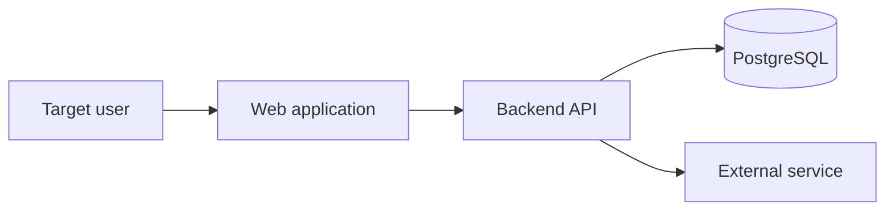

# Architecture: [System Name]

> Status: Draft | In review | Accepted | Superseded
> Owner: [Name or role]
> Last updated: YYYY-MM-DD
> Product source: [path to the project's `product.md`]

**Build Like This note:** design this system after the product intent is clear.
Every component and dependency should trace to a requirement, constraint, or
measured risk. Do not add infrastructure merely because an AI agent recognizes
the pattern.

## Before you begin

Start with the product document and the highest-cost uncertainty. Describe the
simplest system you can justify now, the costs it creates, and the evidence that
would make you change it.

## Executive summary

[Summarize the architecture, primary boundaries, and the most important trade-off.]

## Product requirements and constraints

| Requirement/constraint | Architectural implication |
| --- | --- |
| [Link to product need, metric, or constraint] | [Design response] |

## System context

### Actors and external systems

- **[Actor/system]:** [Relationship and trust level]

### Context diagram



[Explain the important request, asynchronous, and failure flows.]

## Architecture principles

- [Project-specific boundary or design rule]
- [Example: payment state is accepted only from verified server-side events.]

## Component design

| Component | Responsibility | Owns | Public interface | Must not own |
| --- | --- | --- | --- | --- |
| Web | [Responsibility] | [State/artifacts] | [Interface] | [Excluded concern] |
| API | [Responsibility] | [State/artifacts] | [Interface] | [Excluded concern] |

### Backend architecture

[Describe modules, domain services, entry points, repositories, integrations, jobs, and their dependency direction. Explain why a modular monolith or distributed design fits.]

### Frontend architecture

[Describe routes, server/client boundaries, feature modules, data fetching, state ownership, components, accessibility, and error handling.]

### Background work

[Describe queues, schedules, idempotency, retries, timeouts, dead-letter handling, and operator recovery—or state why none is needed.]

## Repository and folder structure

```text
[Show the proposed tree with comments for non-obvious boundaries.]
```

### Dependency rules

1. [Allowed dependency direction]
2. [Public interface rule]
3. [Forbidden coupling]

## Data architecture

### Entities and ownership

| Entity | Purpose | Owning module | Sensitive fields | Retention |
| --- | --- | --- | --- | --- |
| [Entity] | [Purpose] | [Module] | [Fields/none] | [Policy] |

### Relationships and invariants

[Include an ER diagram if helpful. State unique constraints, ownership, and invariants.]

### Transactions and concurrency

[Define transaction boundaries, locking or optimistic concurrency, and duplicate-event handling.]

### Indexes and access patterns

| Query/access pattern | Expected volume | Index or strategy |
| --- | --- | --- |
| [Query] | [Estimate] | [Index/plan] |

### Migrations, backup, and recovery

[Describe expand-and-contract migrations, backup frequency, recovery objectives, and restore testing.]

## API contracts

> Machine-readable contract: [Link to OpenAPI/schema]

| Operation | Purpose | Auth/permission | Request | Success | Errors |
| --- | --- | --- | --- | --- | --- |
| `POST /v1/...` | [Purpose] | [Rule] | [Schema link] | [Status/schema] | [Codes] |

### API conventions

- **Error envelope:** [Shape]
- **Pagination:** [Cursor/limit rules]
- **Idempotency:** [Operations and key behavior]
- **Versioning/deprecation:** [Policy]
- **Rate limits:** [Policy]

## Authentication and authorization

- **Identity provider/approach:** [Choice and reason]
- **Session/token lifecycle:** [Creation, storage, expiry, refresh, revocation]
- **Authorization model:** [Role, ownership, policy checks]
- **Tenant isolation:** [Application and database controls]
- **Abuse controls:** [Rate limiting, lockout, verification]
- **Audit events:** [Sensitive events captured]

## Storage and external integrations

| Integration | Purpose | Adapter boundary | Timeout/retry | Failure behavior | Data shared |
| --- | --- | --- | --- | --- | --- |
| [Vendor] | [Purpose] | [Interface] | [Policy] | [Degraded mode] | [Data] |

## AI and MCP design (if applicable)

- **Model/provider routing:** [Models, tasks, fallback, reason]
- **Prompt ownership/versioning:** [Location and release process]
- **Structured outputs:** [Schemas and validation]
- **Tools/MCP:** [Permissions, allowlist, confirmation, untrusted output handling]
- **Evaluation:** [Datasets, quality thresholds, regression process]
- **Safety/privacy:** [Input/output controls and retention]
- **Cost/latency budgets:** [Limits and telemetry]

## Security and privacy

### Trust boundaries and threats

| Threat or abuse case | Asset | Mitigation | Residual risk |
| --- | --- | --- | --- |
| [Threat] | [Asset] | [Control] | [Risk] |

### Data protection

[Describe collection minimization, encryption, secrets, least privilege, export, deletion, and log redaction.]

## Deployment

### Environments

| Environment | Purpose | Data policy | Deployment trigger |
| --- | --- | --- | --- |
| Local | Development | Synthetic | Manual |
| Preview/staging | Validation | Synthetic/sanitized | Pull request/main |
| Production | User traffic | Production | Approved pipeline |

### Topology and delivery

[Describe Vercel, Render, Docker/VM, region, networking, artifacts, CI/CD, secrets, migrations, health checks, and graceful shutdown.]

### Rollout and rollback

[Describe feature flags, canary/progressive release, rollback conditions, and forward recovery.]

## Observability and operations

| Signal | What it answers | Source | Alert/owner |
| --- | --- | --- | --- |
| [Metric/log/trace] | [Question] | [System] | [Threshold/role] |

- **Service-level indicators/objectives:** [Critical journey and objective]
- **Runbooks:** [Links]
- **Incident owner:** [Role]

## Testing strategy

| Risk/behavior | Test level | Environment | Required in CI |
| --- | --- | --- | --- |
| [Domain rule] | Unit | Test | Yes |
| [Critical journey] | End-to-end | Preview/staging | Yes/No |

## Performance, cost, and scaling

### Expected load and budgets

| Dimension | Initial estimate | Budget/limit |
| --- | --- | --- |
| Active users/requests | [Estimate] | [Limit] |
| API latency | [Estimate] | [p95 target] |
| Storage | [Estimate] | [Cost/size] |
| AI usage | [Estimate] | [Cost/latency] |

### Scaling triggers

| Trigger | Evidence | Action | Added complexity |
| --- | --- | --- | --- |
| [Measured threshold] | [Metric] | [Index/cache/queue/replica/extraction] | [Trade-off] |

## Decisions and trade-offs

| Decision | Options considered | Reason | Consequence | ADR |
| --- | --- | --- | --- | --- |
| [Choice] | [Options] | [Constraint-linked reason] | [Positive and negative] | [Link] |

## Risks and open questions

| Item | Type | Impact | Mitigation/answer owner | Due date |
| --- | --- | --- | --- | --- |
| [Risk/question] | Risk/Question | [Impact] | [Role/action] | [Date] |

## Validation and implementation sequence

1. [Technical spike for the riskiest assumption]
2. [First backend contract and vertical slice]
3. [Frontend integration]
4. [Production readiness and rollout]

## Change log

| Date | Change | Reason | Author |
| --- | --- | --- | --- |
| YYYY-MM-DD | Initial design | [Reason] | [Name/role] |
